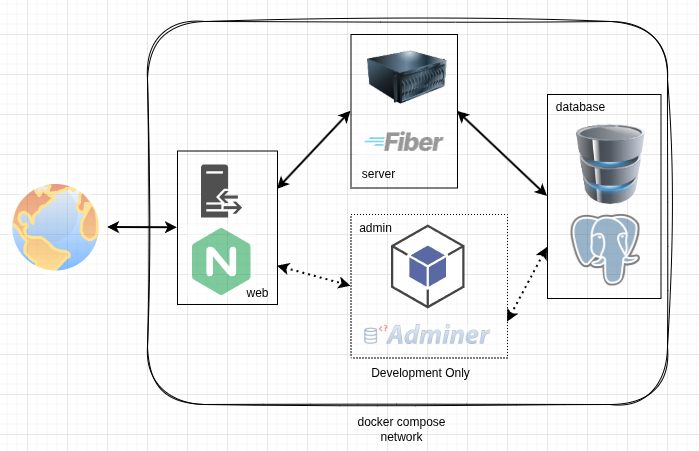

# my app

Web application full-stack production demonstration using Docker containers.

## Service Overview

### ADMIN

[**Image:**](https://hub.docker.com/_/adminer) `adminer:5.4.1`

#### tasks

- postgres `database` service administration

### DATABASE

[**Image:**](https://hub.docker.com/_/postgres) `postgres:18.1-alpine`

#### tasks

- staff bios, events, general content

### SERVER

[**Image:**](https://hub.docker.com/_/golang) `golang:1.25.5`

#### tech stack

- [Fiber](https://gofiber.io/) Go web framework based on Fasthttp
- [html/template](https://pkg.go.dev/html/template) Go standard library html templating engine
- [htmx](https://htmx.org/) extends HTML with AJAX, CSS transitions and more from the server
- Vanilla CSS

#### alternatives

- `Fiber` vs Go standard library [net/http](https://pkg.go.dev/net/http@go1.25.5)
- `html/template` vs [Templ](https://templ.guide/)
- `Vanilla CSS` vs [tailwindcss](https://tailwindcss.com/)

### WEB

[**Image:**](https://hub.docker.com/_/nginx) `nginx:1.27-alpine`

#### tasks

- reverse proxy

## Usage

Production: `docker compose up --build --detach`  
Development: `docker compose -f compose.dev.yml up --build`
